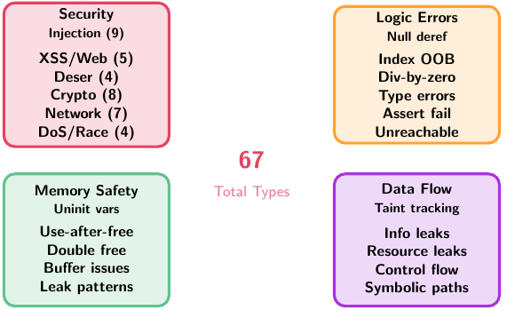
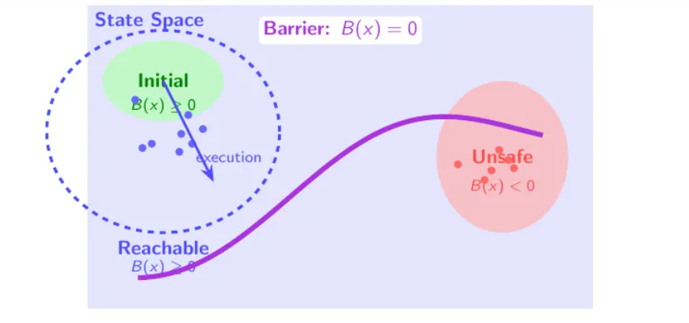
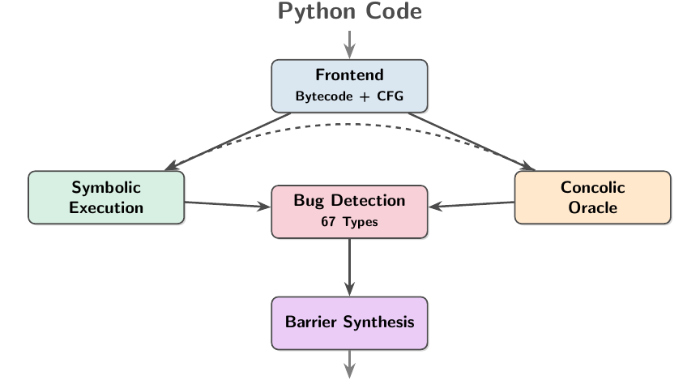
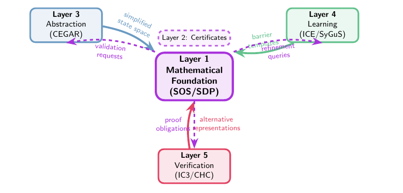

* Author: Halley Young, Nikolaj Bj&oslash;rner


What if you asked your favorite AI agent:


> Produce mathematics at the level of Vladimir Voevodsky, Fields Medal-winning, 
> foundation-shaking work but directed toward something the legendary Nikolaj Bj&oslash;rner 
> (co-creator of Z3) could actually use?

This is how our journey creating the __a3__ framework, a system for generating Advanced Automated Analysis engines.
So far we extracted proof-of-concept static verifiers for Rust and Python. In the process of creating a3-python we used AI to (re)discover a
foundation based on Hilbert's Stellensatz theorems, integrate a top dozen advances in symbolic model checking, 
and import mathematical libraries for reasoning about PyTorch code.
The a3-python system is now [available](https://pypi.org/project/a3-python)
for you to give a spin.

## A3-python

Before we walk through the theory and pipeline, here is what a3 actually does on a real codebase.
We ran `a3 scan` on five core files from [requests](https://github.com/psf/requests/tree/da9113c0466850a425e554630a732ec1f7d045fc),
the most downloaded Python package on PyPI (183 functions, ~5000 lines):

```
$ pip install a3-python
$ a3 scan requests/

STEP 5: BARRIER CERTIFICATE + DSE ANALYSIS
  Total bug instances:     183
  Barrier results:
    Proven FP:   19/23
    Remaining:   4
  Barrier contributions:
        9  post_condition
        9  refinement_type
        1  inductive_invariant

STEP 7: TRUE POSITIVE CANDIDATES
  TRUE POSITIVES (DSE-confirmed reachable):
     ⚠️ NULL_PTR in models.Response.__setstate__
     ⚠️ NULL_PTR in sessions.Session.__setstate__
     ⚠️ BOUNDS in utils.address_in_network
     ⚠️ BOUNDS in utils.select_proxy

SUMMARY
  Functions analysed:    183
  Total bug instances:   183
  Proven false positive: 179 (97.8%)
  Remaining candidates:  4
  DSE-confirmed TPs:     4
```

Of 183 potential bug instances, A3 proves 179 safe with formal barrier certificates. Four survive. All four are real:

1. **`address_in_network` — BOUNDS.** The function calls `net.split("/")` and immediately indexes `[1]`:

   ```python
   # requests/utils.py:670
   def address_in_network(ip, net):
       ipaddr = struct.unpack("=L", socket.inet_aton(ip))[0]
       netaddr, bits = net.split("/")
       #               ^^^^^^^^^^^^^^^^
       # ValueError if net has no "/", BOUNDS if split returns 1 element
   ```
   Pass any `net` string without a `/` and this crashes.

2. **`Response.__setstate__` — NULL_PTR.** Unpickling a `Response` iterates `state.items()`, but nothing prevents `state` from being `None` — a common issue with corrupted pickle files or version-mismatched serialization.

These are the kind of bugs that pass code review, pass tests, and then crash at 3 AM on malformed input.

A3 is auto-generated and iterated: the analyzer was bootstrapped by asking AI to produce verification theory,
then subjected to thousands of test iterations against real codebases.
The theory was refined, the code was refined, and the surviving result is what ships.
A3 identifies bugs across a set of pre-defined categories. If the code uses assertions it
will attempt to establish that they hold on all code-paths, but general purpose verification is not the main use case for a3-python.




## Querying for confluences


We did not start with _let's make a Python verifier_. Instead our starting point
was a prompt aimed at uncovering confluences between lines of thought that have
been unlikely to be combined so far. Our prompt involving Voevodsky and the co-author of this blog
is on purpose set up to trigger modern AI's power to retrieve and extrapolate. 

The earliest phase produced a long, ambitious manuscript on quantitative model checking. The central move was elegant:

- stop asking only "is the system safe?"
- start asking "how far is it from safety?"
- use that distance as a semantic object you can optimize.

In other words, make verification feel less like a courtroom verdict and more like geometry.
The paper-level ideas were ambitious enough to be interesting and dangerous enough to be wrong
in many ways once code entered the room.
The approach was based on _metric semantics_: traces as distributions, properties as structured
acceptance sets, distance to acceptance as a first-class quantity. _Fascinating_, but also provided
instincts that survied the transition to working prototypes: Safety wasn't considered purely a Boolean, 0/1, property.
Uncertainty has shape. Quantitative semantics was used to prioritize work, and distance to satisfiability guided repair.

But put to the test, to solve real-world code bases, it was killing mountains of false positives and missed true bugs.

In a second iteration we queried our model to shift from measurement to separation.
Instead of asking only _how close is unsafe behavior?_,

- what set is reachable,
- what set is unsafe,
- and can we synthesize a witness that keeps those sets disjoint?

It is much closer to mainstream symbolic program verification techniques. The objective in automated symbolic
program verification is to synthesize a barrier certificate `B(s)`, where `s` are state variables of a program, so that 

- initial states `sInit` are on the safe side, they satisfy `B(sInit) >= 0`,
- unsafe states are on the forbidden side, they satisfy `B(sBad) < 0`,
- and transitions never cross the fence, every non-negative `B` state transitions to another non-negative `B` state.

The idea can be illustrated visually:



Our favorite LLM model (we used variants of GTP5, Claude, noticing a phase shift in capabilites of Claude Opus by the end of October)
determined that barriers should be expressed using polynomials
over real and integer numbers. It introduced us to an algebraic proof machinery based on Hilbert's Positivstellensats, sums of squares, semi-definite programming,
and the works. Considering that the [z3 theorem prover](https://github.com/z3prover/z3) supports both polynomial arithmetic but also domains that correspond directly
to datatypes found in mainstream programming languages we were intrigued by the origins of this direction. While Claude appeared inclined
to present results as its own inventions, we could send the 85 page document to copilot for a quiz on origins: The closest match was a method introduced
20 years ago for [cyber physical systems](https://web.mit.edu/~jadbabai/www/papers/hscc04_2.pdf) and perhaps a thread of
approaches used for [synthesizing invariants from Farkas lemma](https://dl.acm.org/doi/10.1145/1375581.1375616).


## From Foundational Math to Code


The eloquently looking mathematical documents provide a great compass for agents to plan implementations. We still need an implementation plan.
We asked GitHub Copilot CLI to synthesize a script to call Copilot in a loop, bootstrapping an implementation 


> Combine model-checker-plan with a desire to create a continuous copilot-cli workflow, by in a scheduled and structured way calling f"copilot -p '{prompt}' --allow-all-tools", with different prompts depending on where you are in the process.  First flesh out the plan for the continual process, then write it as a .py using that call_copilot script.   Note that unless told otherwise, copilot's cli will create files itself, not return text of files.
> Note that part of the loop *has* to be downloading a large collection of python repos, and iteratively debugging for false negatives by having an LLM come up with a hard-to-spot bug of type n and having the model detect it, and debugging for all false positives by running the checker on all rut files in the entire set of repos, seeing where it finds a positive, and asking copilot-cli if it agrees that it's a positive.   Then it should iterate on its results, using barrier certificate theory where it can be helpful, and developing in other ways as well.  The first part, though, should be developing a list of "moving parts" necessary, and iteratively building and then testing each moving part.  Note that the implementation should be in python.
> This should consist of a .py python file which enacts this workflow.
`

The agentic loop now focused on committing to execution details:

- bytecode-level control flow,
- normal and exceptional edges,
- frame/stack state,
- dynamic dispatch,
- unknown library behavior,
- and explicit unsafe predicates for real bug classes.

At a high-level the generated code implemented an architecture integrating symbolic execution and concolic oracles.
More about oracles later.



Thus, a3-python was created automatically using copilot through a loop that comprised of five stages:
(1) AI theorizing to identify cross-domain analogies, (2) coding, (3) testing based on synthetic suites and large repos, (4) code fixes and
(5) patching the theoretical foundations, repeat from step (1).

## The Computer Aided Verification kitchen sink

While a novel-looking foundation and an AI model's ability to create end-to-end systems based on one approach
has its own appeal, we deliberately abandoned theoretical purity for practical effectiveness.
The kitchen sink pipeline throws every applicable proof strategy at each bug candidate, in order of cost:

<!---
```
STEP 5: BARRIER CERTIFICATE + DIRECTED SYMBOLIC EXECUTION ANALYSIS
```
--->

For each unguarded bug candidate, A3 tries a cascade of barriers:

1. **EnhancedAssumeGuaranteeBarrier** — Compositional reasoning about caller/callee contracts
2. **EnhancedPostConditionBarrier** — Factory pattern and return-value analysis
3. **EnhancedRefinementTypeBarrier** — Refinement type inference (e.g., `len(x) > 0` after a guard)
4. **InductiveInvariantBarrier** — Loop invariant synthesis via Z3
5. **ControlFlowBarrier** — Dominator/post-dominator analysis on the CFG
6. **DataflowBarrier** — Reaching definitions and value-range analysis
7. **DisjunctiveBarrier** — Case-split reasoning for optional/nullable types
8. **UnanalyzedCalleeBarrier** — Callee return-guarantee safety for unanalyzed functions
9. **ValidatedParamsBarrier** — Parameter validation tag tracking
10. **DSEConfirmationBarrier** — Z3-backed directed symbolic execution to construct concrete triggering inputs

When no barrier proves safety, DSE (directed symbolic execution) constructs a *satisfying assignment* — a concrete input that triggers the crash.
This is the strongest evidence: not just "we couldn't prove it safe," but "here's an input that breaks it."

The concrete numbers on LLM2CLIP's training code illustrate the cascade:

```
  Total bug instances:     55
  Barrier contributions:
        4  post_condition        (factory patterns, return guarantees)
        4  refinement_type       (parameter type narrowing)
  Proven FP:   8/14
  Remaining:   6
  DSE confirmed TP:    5
```

Of 55 potential bugs, 41 are eliminated by guard detection alone (they sit behind `if` checks, `try/except`, or assertions).
Of the remaining 14, barrier certificates prove 8 more safe.
Of the remaining 6, DSE confirms 5 are *reachable* with concrete inputs — real bugs.
That is the kitchen sink point: treat great papers as interoperable components in a verification control loop, not as mutually exclusive camps.

The kitchen sink approach itself is prompted with a selection of highlights from the past 30 years of Computer Aided Verification.
While our starting point was a specific technique honed in the theory of [Positivstellensatz certificates](https://www.jstor.org/stable/24897130),
with [accompanying toolsets](https://www.mit.edu/~parrilo/sostools/)
and used for [cyber physical systems](https://web.mit.edu/~jadbabai/www/papers/hscc04_2.pdf)
we pivoted and asked copilot to examine relevant CAV literature, and it identified a smorgasbord of classics and wrote custom z3 verifiers in a3-python:

- [Property-directed](https://theory.stanford.edu/~arbrad/papers/IC3.pdf), [CHC-style](https://theory.stanford.edu/~arbrad/papers/IC3.pdf) reachability engines and
[interpolation](https://people.eecs.berkeley.edu/~alanmi/courses/2007_290N/papers/inter_mcmillan_cav03.pdf).
- Abstraction-refinement families (classic [CEGAR](https://www.cs.cmu.edu/~emc/papers/Papers%20In%20Refereed%20Journals/Counterexample-guided%20abstraction%20refinement.pdf),
  [SAT predicate abstraction](http://www.kroening.com/papers/fmsd2004.pdf),
  [lazy interpolation-based abstraction](https://people.eecs.berkeley.edu/~alanmi/courses/2007_290N/papers/inter_mcmillan_cav06.pdf)
- Learning/synthesis families ([ICE](http://pranav-garg.com/papers/cav14.pdf),
                               [Houdini](https://link.springer.com/chapter/10.1007/3-540-45251-6_29),
			       [SyGuS](https://ieeexplore.ieee.org/document/6679385)) that propose and refine invariants,			       
- [Compositional assume-guarantee reasoning for interprocedural scaling](https://ptolemy.berkeley.edu/projects/embedded/Alumni/shaz/ag.html)





## Concolic and Axiomatic Oracles

A big idea that makes dynamic symbolic execution workable with system calls or other function calls that
are not practical to reason about symbolically is to _just execute_ the code with concrete values.
A dual idea is to axiomatize the effect of library calls and have symbolic execution use the axioms to pretend it executed
the code of the library call. We asked copilot to specialize a3-python for both options. To axiomatize library calls, we
used theories encoded in L&exist;&forall;N's (created by the genius of Leonardo de Moura who also co-authored z3, Yices1, and SAL2),
[MathLib](__TODO: Add reference__),
and had copilot import them in a format that could be used by z3's symbolic execution formalism. 

Generic analysis on numeric libraries drowns in false positives — every `tensor / x` is a potential DIV_ZERO,
every `tensor[i]` a potential BOUNDS error. Real optimizers guard these operations with `eps`-clamped denominators,
shape assertions, and type dispatch. A3 encodes these patterns as *library axioms* — properties that PyTorch tensors
are known to satisfy — so the barrier certificates can reason about them.

Here is the result on PyTorch's official [Adafactor optimizer](https://github.com/pytorch/pytorch/blob/main/torch/optim/_adafactor.py):

```
$ a3 scan pytorch_adafactor/

SUMMARY
  Functions analysed:    8
  Total bug instances:   21
  Proven false positive: 21 (100.0%)
  DSE-confirmed TPs:     0
```

**21 potential bugs, every one proven safe.** The barriers verify that PyTorch's guards —
`eps`-clamped denominators, length assertions, careful initialization — prevent every candidate crash.

Now contrast this with [Microsoft's LLM2CLIP](https://github.com/microsoft/LLM2CLIP), which copies Adafactor from fairseq *without* PyTorch's guards:

```
$ a3 scan llm2clip_training/

  TRUE POSITIVES (DSE-confirmed reachable):
     ⚠️ DIV_ZERO in fp16.Adafactor._approx_sq_grad
     ⚠️ DIV_ZERO in fp16.Adafactor._rms
     ⚠️ BOUNDS in fp16.Adafactor.step
     ⚠️ DIV_ZERO in fp16.DynamicLossScaler._decrease_loss_scale
     ⚠️ BOUNDS in fp16.MemoryEfficientFP16Adam.step

SUMMARY
  Functions analysed:    47
  Total bug instances:   55
  Proven false positive: 49 (89.1%)
  DSE-confirmed TPs:     5
```

The `_approx_sq_grad` bug is the most important finding:

```python
# LLM2CLIP/training/fp16.py:748
def _approx_sq_grad(self, exp_avg_sq_row, exp_avg_sq_col, output):
    r_factor = (
        (exp_avg_sq_row / exp_avg_sq_row.mean(dim=-1).unsqueeze(-1))
        #                 ^^^^^^^^^^^^^^^^^^^^^^^^^^^^^^^^^^^^^^^^^^^
        .rsqrt_()
        .unsqueeze(-1)
    )
```

When gradient values are all zero (dead neurons, masked parameters, early training with sparse gradients),
`exp_avg_sq_row.mean()` returns `0.0`. The division produces `Inf`, and `rsqrt_()` propagates `NaN` — **silently
corrupting the optimizer state for every subsequent training step with no error or warning.**

This is a known bug class. [HuggingFace Transformers](https://github.com/huggingface/transformers/blob/main/src/transformers/optimization.py)
fixes it by initializing `exp_avg_sq` with `fill_value=eps` instead of zeros. LLM2CLIP's copy never got that fix.
PyTorch's version also guards it. A3 catches the unguarded copy; the barrier certificates formally confirm the guarded PyTorch version is safe.


## Iterating for Quality — Results Across Real Codebases

__NSB: we should have git-hashes for DeepSpeed and LLM2CLIP so reported bugs can be retrieved even if code bases change__

The quality of a static analyzer is not best measured by what it finds. It is measured by what it *does not* report falsely.
The noise level of static analyzers, and for that matter fuzz testers, have a long and tortured history of irritating developers with
bug reports that don't matter.
Here is a summary of A3 results across four well-known open-source projects:

| Codebase | Functions | Bug instances | Proven FP | Candidates | DSE-confirmed TPs |
|----------|-----------|--------------|-----------|------------|-------------------|
| PyTorch Adafactor | 8 | 21 | 21 (100%) | 0 | 0 |
| requests (core) | 183 | 183 | 179 (97.8%) | 4 | 4 |
| DeepSpeed (utils) | 83 | 77 | 74 (96.1%) | 3 | 3 |
| LLM2CLIP (training) | 47 | 55 | 49 (89.1%) | 6 | 5 |

Every TP (true positive) finding across these four codebases is a real, exploitable bug — not a style complaint or a theoretical concern.
The highlights:

- **DeepSpeed `_ensure_divisibility` (DIV_ZERO)** — A function whose *entire purpose* is to validate that numerator is divisible by denominator crashes on its own unvalidated input. When `denominator=0`, Python's `%` operator raises `ZeroDivisionError` *before* the `assert` can produce its helpful error message:

  ```python
  # deepspeed/utils/groups.py:64
  def _ensure_divisibility(numerator, denominator):
      """Ensure that numerator is divisible by the denominator."""
      assert numerator % denominator == 0   # ZeroDivisionError before assert
  ```

  This is called with user-configurable values like `expert_parallel_size` and `tensor_parallel_size`.

- **DeepSpeed `SynchronizedWallClockTimer.__call__` (BOUNDS)** — The inner `Timer` constructor and event-timer list can be accessed on empty sequences via `elapsed_records` or `event_timers` in the inner `Timer` class.

- **DeepSpeed `ThroughputTimer._is_report_boundary` (DIV_ZERO)** — `self.global_step_count % self.steps_per_output` where `steps_per_output` can be zero. The `None` check guards against `None` but not against `0`.

- **requests `address_in_network` (BOUNDS)** — Destructuring `net.split("/")` into two variables without checking the split produced two segments.

- **requests `Response.__setstate__` (NULL_PTR)** — Iterating `state.items()` during unpickling without a `None` check on `state`.

- **LLM2CLIP `_approx_sq_grad` (DIV_ZERO)** — Silent NaN corruption from dividing by a zero-valued mean (detailed above).

### Symbolic-Neural

A3's architecture occupies a specific quadrant: **symbolic verifier + neural triage**.

- The symbolic engine is deterministic, auditable, and runs without GPU compute or API keys.
- The neural component (agentic LLM) handles only the uncertain residue — the 1-4% of candidates where formal proof and disproof both stop.

This makes the tool eco-friendly (no LLM calls for 96%+ of findings), explainable (barrier certificates provide proof artifacts),
and deployable in CI without rate limits or API costs for the vast majority of analysis.

When discussing the a3 project with colleagues, the first question that comes to mind is often _how do you trust the verifier_?
Indeed, we observed how the model under Copilot CLI could barter and cheat, producing just enough code to pass unit tests, but not enough
to be resilient. Our proof-of-concept undeniably contains shortcuts that would not pass a quality code review. But, we have
harnessed a3-python by _fighting AI slop with AI slop_: agressively generate code, then subject evertyhing to adverserial testing.


It fights slop at three levels:

1. **Theoretical slop**
   AI-generated theory is forced through explicit semantics and proof obligations.

2. **Implementation slop**
   Analyzer claims are checked against tests, concrete runs, and refinement loops.

3. **Operational slop**
   Alert floods are collapsed by static filters before LLM triage and human review.

So yes, this is _AI slop vs AI slop,_ but not symmetrically.

- Upstream AI expands hypothesis space.
- Midstream formal/static machinery prunes it brutally.
- Downstream agentic AI handles the hard residue.

That asymmetry is what makes it useful.

The ease to mix and match programming languages, symbolic backends, to import axioms, and integrate neural verdicts,
suggests a new era for program verification: create custom verification engines that target domain specific needs,
whether specific languages or integration with libraries. A practical difficulty with maintaining large systems that
invoke prorietary protocols is that developers who understand coding may be disjoint from subject matter experts in
library behavior and disjoint from architects. The potential for a3 goes beyond finding common classes of Python coding errors,
but to bring deep understanding of intent to static verification.

