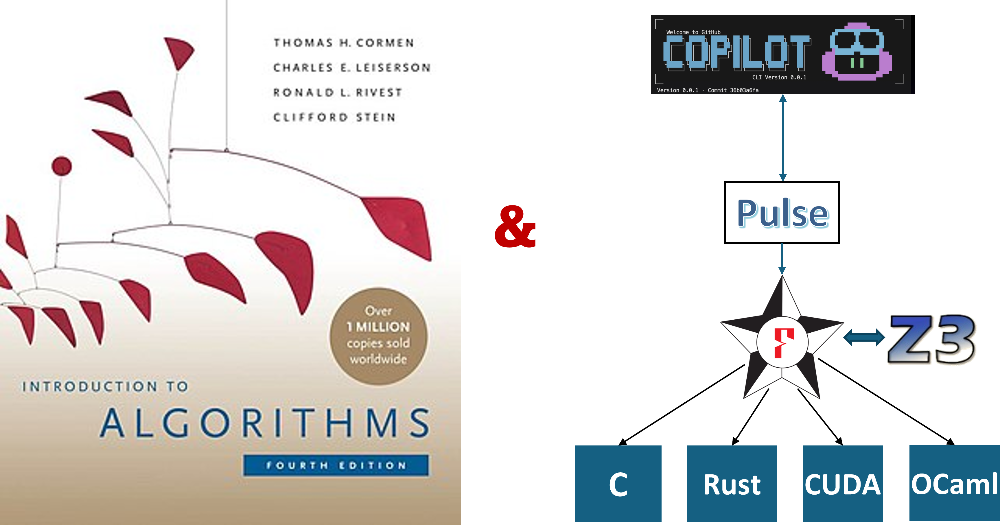

* Author: Nik Swamy with thanks to Gabriel Ebner, Lef Ioannidis, Guido Martinez,
  Matthai Philipose, Tahina Ramananandro


Late last spring, Matthai Philipose and I were chatting about how it would be
interesting to see if AI could help in building provably correct implementations
of classic algorithms and data structures, such as those in the [Introduction to
Algorithms](https://en.wikipedia.org/wiki/Introduction_to_Algorithms) textbook
by Cormen, Leiserson, Rivest, and Stein (commonly referred to as CLRS). We had
been doing some experiments with post-training models with reinforcement
learning, using a [dataset](https://arxiv.org/abs/2405.01787) of more than a
million lines of code and proofs in [F\*](https://fstar-lang.org) and
[Pulse](https://fstar-lang.org/tutorial/book/pulse/pulse.html). But, we soon
realized that the models we were working with at the time, despite the boosts
from reinforcement learning, were not up to the task and we set the work aside.

A few weeks ago, in a [previous post](/blog/2025-02-04-nik-agentic-pop), I wrote
about our experience using AI to build six sequential and two concurrent
libraries in F\* and Pulse, with proofs of correctness in concurrent separation
logic, a total of some 10,000 lines of code and proofs. That experience was eye
opening, and since then we've had Opus 4.6 and Codex 5.3 come out, and many
improvements in Copilot CLI, our agentic coding tool---we couldn't resist
revisiting our goal from last summer.

This post is about formalizing parts of the CLRS textbook in F* and Pulse using
AI agents and Claude Opus 4.6. Over the course of a few weeks, agents (with
oversight from primarily one person) have produced nearly 100,000 lines of
specifications, code, and proofs, for around 50 data structures and algorithms.



> Note: Introduction to Algorithms, often referred to as CLRS, is available from
 [MIT
 Press](https://mitpress.mit.edu/books/introduction-algorithms-third-edition).
 The image above uses [Wikipedia's cover image for the
 book](https://en.wikipedia.org/wiki/File:Clrs4.jpeg), which is available under
 a fair-use policy. Note, we did not train any AI models on the content of this
 book, and we do not have any special access to the content of this book. We
 simply used a PDF of the book, converted to text by pdftotext, as a source of
 natural language descriptions and allowed agents to reference this content when
 implementing and proving algorithms correct in F* and Pulse.

The ability to produce provably correct code at this scale is, frankly, jaw
dropping. But, many challenges remain, with the most prominent: how to
effectively audit specifications? We describe our experience in detail,
highlighting a couple of especially interesting examples, but we start with a
few main takeaways.

* **Program Proof Tools Work!**

  Tools to formally prove the correctness of programs, including low-level
  imperative programs, have been around for a while and are quite capable of
  handling proofs of non-trivial algorithms and data structures. That said,
  expressiveness of program logics is important and Pulse's concurrent
  separation logic is naturally suited to proofs of pointer manipulating code,
  including things like cyclic data structures. Enhancing expressive power and
  proof automation remains an important research direction, e.g., prompted by
  this work, we added experimental support for a limited form of total
  correctness proofs (termination proofs) to Pulse and easily got agents to use
  this new feature.

* **Specification Audit and Review is a Key Challenge**

  Proofs are great, but only as good as the properties that they establish. Even
  with provably correct code, AI slop is real, especially in that it can prove
  specifications that are not necessarily what one would want, both in terms of
  the properties themselves and in terms of abstraction and reuse. However, with
  multiple rounds of specification audit critique and revision, it is possible
  to get agents to produce good specifications. Easing the process of
  specification audit, and matching those against intent, is perhaps the most
  important open problem in this space. Shuvendu's recent [post on intent
  formalization](/blog/2026-03-05-shuvendu-intent-formalization) is right on the
  mark here.
  
* **Empirical Language Design and Usability Studies**

  With agents pounding away at our programming tools, we have a great
  opportunity to conduct empirical PL usability and design studies, mining
  traces of agent logs to understand where the tools work well and where the
  agents workaround rough edges. At a more conceptual level, one could also
  study different agentic programming and proof strategies, efforts that have
  only recently started to be explored, with much difficulty, on small groups of
  human programmers (e.g., see [this recent
  paper](https://arxiv.org/abs/2508.02733)). Improving tools for both human and
  agentic use is an important direction to pursue.

* **AutoCLRS is Available, Though Still a Work in Progress**

  Our agent-generated code and proofs are available at
  [FStarLang/AutoCLRS](https://github.com/FStarLang/AlgoStar) and a lightly
  documented version of the code, perhaps easier to browse at first, is also
  available at [AutoCLRS-Docs](https://fstar-lang.org/docs/AutoCLRS). By no
  means is this is a complete formalization of the book, and it is far from
  polished. But, it is a substantial start, and we expect to keep improving it,
  with a few possible eventual goals.

    - We believe this could serve as a useful reference guide for future uses of
      F\* and Pulse, both human and not. Already, in several other projects,
      agents have referenced this code to understand how to write certain kinds
      of proofs, and we expect, with (much more!) further polish, this could
      become even more useful. Parts of it could also be included in F* and
      Pulse standard library.

    - Again, with more work, we believe it could be possible to extract the code
      into standalone, reusable libraries in OCaml, C, or Rust, usable by
      others beyond the F\* and Pulse community.

    - We welcome any feedback and contributions to the repository, especially in
      terms of specification review---there's a lot of work still left to do
      there!

Ok, let's dive in!

## Setup

As in my [previous post](/blog/2025-02-04-nik-agentic-pop), we used Copilot CLI,
this time with Opus 4.6, using Copilot CLI's
[autopilot](https://docs.github.com/en/copilot/concepts/agents/copilot-cli/autopilot)
mode. One has to use this with care, since the agent has full access to the
machine---I used a relatively well locked down machine whose state I didn't care
about. That said, I also did not observe the agent doing anything nefarious.

In comparison with my previous post, this time I also wired up an
[FStar-MCP](https://github.com/FStarLang/fstar-mcp), a tool that Lef built on
top of the LSP server exposed by
[FStar-VSCode-Assistant](https://github.com/FStarLang/fstar-vscode-assistant).
This allows the agent to interact incrementally with the F\* type checker in
multiple concurrent sessions, where the type checker maintains state to track
which parts of a file have already been checked. This improves the latency of
checking agent output, and since these proofs take many iterations of verifier
feedback, reducing the latency helps keep things moving. However, we also found
that agents don't always use the MCP server and fallback to just running F* from
the command line.

The agent had access to a PDF of CLRS. My initial prompt was just a single line
"pick a collection of algorithms and data structures from CLRS to implement with
proofs of functional correctness in F* and Pulse". It picked around 50
algorithms and data structures spread across 22 chapters. Some of the chapters
it left out did not have any algorithms in them, instead providing mathematical
background. Other chapters on randomized algorithms and multi-threaded
algorithms were also left out---these could be interesting to look into in the
future, since especially the multi-threaded algorithms would be a great fit for
Pulse's concurrent separation logic.

The agent produced around 10,000 lines of code and proofs very quickly, but my
initial excitement quickly turned to the question of how to review what was
proven. It took about a month of nudging the process, a relatively hands-off
interaction while I was doing other things, to reach this point---100,000 lines
of code and proofs, with a very rough count of around 5,000 lines of
specification to be audited for functional correctness. That's a significant
amount of specification to review, but it's significantly less than the total
amount of code and proofs. That's one of the main advantages of proof-oriented
programs, the proofs are checked mechanically, so one only has to review the
specifications. Though, as I pointed out in my previous post, specifications are
not absolute, and there are aspects of program behavior that one still has to
check manually. Performance properties are a good example of this, but in the
case of AutoCLRS, one also has to check if the algorithm implemented is the one
that was intended, e.g., is an implementation that claims to be Quicksort really
implementing the Quicksort algorithm and not actually implementing, say,
insertion sort.

In the remainder of this post, I'll highlight a few examples from the library.

## The Good, The Bad, and the Ugly: A Brief Tour of our Experience

Formalizing CLRS in F\* and Pulse is a interesting challenge, since the
algorithms and data structures in CLRS are described in pseudo-code, with
correctness arguments in natural language. One has to turn these natural
language proofs into formal proofs, and to do that in Pulse, one also has to
find ways to express those proofs in the ownership-based discipline of
separation logic, which appears nowhere in the CLRS book. However, the model's
knowledge of the separation logic literature and apparent fluency in Pulse,
seems sufficient to meet this challenge.

Further, a lot of the content of the book is also about asymptotic complexity of
algorithms---for this there is very little prior formalization available in F\*
and Pulse, so this also poses an interesting challenge. So far, I focused the
agents more on the functional correctness aspects, but some of the algorithms
also have interesting complexity properties proven.

Finally, a bit of background: A common style in formalizing imperative
algorithms and data structures is to first write a purely functional
specification of the algorithm or data structure, and then to prove that the
imperative implementation *refines* the functional specification. Separately,
one can then prove that the functional specification satisfies the properties
that one wants. This is also the style used in AutoCLRS, as I'll illustrate with
examples below.


### Doubly Linked Lists

Chapter 10 for CLRS describes several basic data structures, including single
and doubly linked lists, stacks, queues. The initial implementation of doubly
linked lists was declared correct by the agent, but on a closer look, it was far
from desirable. Here was the initial definition of the data structure (comments
by agent too):

```fstar
// Array-based list representation (simplified from true doubly-linked list)
type linked_list (t:eqtype) = {
  data: V.vec t;
  size: B.box SZ.t;
  capacity: erased nat;
}
```

For anyone familiar with linked lists and a bit of F*, it should be clear that
this is not a linked list at all! It's an heap-allocated array with a given
fixed capacity and an size that tracks how many elements are currently in the
list. The comment by the agent "simplified from a true doubly-linked list" is a
bit of an understatement. 

I instructed the agent to actually implement a real doubly linked list with next
and previous pointers. This was the next attempt, also declared correct by the
agent:

```fstar
// Node: key + prev + next pointers (doubly linked)
type node = {
  key:  int;
  next: option (box node);
  // prev pointer is maintained for O(1) delete but not tracked in
  // the recursive predicate (it would create a cycle in ownership).
  // Instead, we track prev consistency as a pure property.
}
```

This is getting closer, but still not right---there is no previous pointer.
While the comment about creating an ownership cycle is correct, it's relatively
straightforward to encode this in Pulse's separation logic. I instructed the
agent to add an explicit previous pointer, noting that there are examples of
this in Pulse's documentation and library and it should adapt it accordingly

On a third attempt, the agent produced the following type and ownership predicate:

```fstar
noeq
type node = {
  key:  int;
  prev: option (box node);
  next: option (box node);
}

let dptr = option (box node)

let rec dls
  ([@@@mkey] p: box node)
  (l: list int {Cons? l})
  (prev_ptr: dptr)
  (tail: box node)
  (last_ptr: dptr)
  : Tot slprop (decreases l)
  = match l with
    | [k] ->
      exists* (v: node).
        pts_to p v **
        pure (v.key == k /\ v.prev == prev_ptr /\
              v.next == last_ptr /\ p == tail)
    | k :: rest ->
      exists* (v: node) (np: box node).
        pts_to p v **
        dls np rest (Some p) tail last_ptr **
        pure (v.key == k /\ v.prev == prev_ptr /\
              v.next == Some np)

let dll (hd tl: dptr) (l: list int) : slprop =
  match l with
  | [] -> pure (hd == None /\ tl == None)
  | k :: rest ->
    exists* (hp tp: box node).
      dls hp (k :: rest) None tp None **
      pure (hd == Some hp /\ tl == Some tp)
```

This is much better---let me explain a bit. 

* A linked list node has a key, and nullable pointers to the previous and next
  nodes---Pulse's box type, for references to heap allocated data, are already
  nullable, so the `option` type here is unnecessary, but it isn't terrible
  either. The key type is specialized to `int`, though typically in Pulse one
  would define it as a type parameter---however, CLRS describes linked lists
  with integer keys, so this was acceptable to me. Of course, to turn this into
  a reusable, general-purpose library, one would want to make this a type
  parameter, a refactoring job that that I think an agent could easily do.

* The `dls` predicate describes a linked list segment from a given pointer `p`
  to a given  tail pointer `tail`, with a given list of keys `l` in between, and
  with a given previous pointer `prev_ptr` and last pointer `last_ptr` that
  track the previous and next pointers of the head and tail nodes of the
  segment.

* And, finally, the `dll` predicate describes a full linked list from a given
  head pointer `hd` to a given tail pointer `tl`, with a given list of keys `l`
  in between.

Going back to my remark about imperative refinement of functional
specifications, we can see this in action here: effectively, `dll hd tl l` says
that the pointer-based data structure referenced by `hd`  is a concrete
representation of the abstract, purely functional list `l`. Operations on doubly
linked lists can then be specified in terms of how they transform the abstract
list `l`.

This is a pretty standard way to describe doubly linked lists in separation
logic, dating back to [John Reynolds' classic
paper](https://home.ttic.edu/~dreyer/seplogic.pdf). It is also similar to
[Pulse.Lib.Dequeue](https://github.com/FStarLang/pulse/blob/main/lib/pulse/lib/Pulse.Lib.Deque.fst),
a library for double-ended queues that Guido Martinez built a while ago, and it
is likely that my instruction to review the library allowed the model to learn
from Guido's implementation.

Using this representation, the agent was able to implement and prove correct a
variety of operations on doubly linked lists, including insertion and deletion
of nodes, and traversal. For example, here is the signature of a function to
delete the element at index `i` where given references to the head and tail of
the list, the postcondition relates the content of the list to a pure function
`remove_at` that removes the `i`th element from `l`.

```pulse
/// LIST-DELETE-NODE: Delete element at index i
fn list_delete_node
  (hd_ref tl_ref: ref dptr)
  (#l: erased (list int) {Cons? l})
  (i: nat {i < L.length l})
  requires exists* hd tl.
    pts_to hd_ref hd ** pts_to tl_ref tl ** dll hd tl l
  ensures exists* hd' tl'.
    pts_to hd_ref hd' ** pts_to tl_ref tl' ** dll hd' tl' (remove_at i l)
```

### Some Takeaways

A doubly linked list is a simple textbook example, but even for this there are
many ways to get it wrong and the agent can take various shortcuts and missteps.
However, with a few rounds of specification critique, I ended up with a
reasonable implementation. In fact, when writing up this post, I noticed a few
more things that I had missed on my initial review and was able to quickly get
the model to fix those up as well.

There are aspects of the implementation that my specification review did not
cover, e.g., most of the operations are implemented as tail-recursive functions,
rather than CLRS's use of while loops. This is not necessarily a problem, but it
does indicate how specification review does not cover all aspects of a program.

Finally, one may be tempted to think that if agents can churn out proofs
automatically, then work on the underlying tools and logics is no longer that
important, since an agent would crush through the proofs no matter the
difficulty. I don't think this is the case. Being able to naturally express
invariants and complete proofs is as important for agents as it has always been
for humans. Some logics and programming languages make it impossible to safely
express cyclic structures. Others, frameworks, like Low* (an earlier DSL for
imperative programming with heaps in F*) do support reasoning about pointer data
structures with cycles, but the proofs are so large and non-modular that it has
never been very practical even for experts to do those proofs in Low*. For
instance, a library for [doubly linked list in
Low*](https://github.com/FStarLang/LowStar/tree/main/examples/doublylinkedlist),
took a PhD student many painful months to implement---from my experience,
getting an agent to do the same in Low* would be no less painful. 


### Red-Black Trees: CLRS vs Okasaki

Chapter 13 of CLRS describes red-black trees, a self-balancing binary search
tree data structure. Red-black trees can be implemented in a variety of ways,
and the agent's training, presumably, includes knowledge of many of them.
Usually, the agent's encyclopedic knowledge is a good thing, but it can also be
a hindrance if the goal is to formalize a given text. Given a formalization
task, the agent doesn't seem to read the text very much at all, and instead just
tries to complete the task from its background knowledge. This tendency came up
in several places, but it was especially easy to see in the case of red-black
trees.

As before the general style of proof of this data structure is to define a
purely functional implementation first, and then to implement an imperative
version and prove that it refines the functional one. In this case, the agent
chose to implement the functional version using Okasaki-style trees, which are a
purely functional trees without any parent pointers and with a different
balancing strategy than the imperative one described in CLRS. CLRS does not
mention Okasaki-style trees at all, and the agent's implementation of the
functional, though Okasaki-style trees do appear in various parts of the F*
library and online documentation.

Next, when implementing the imperative version, after several initial missteps,
the agent produced a correct imperative red-black tree, but rather than
implementing the parent-pointer-based version with rotations, as described in
CLRS, the agent directly implemented the Okasaki-style trees in imperative code,
and proved it to refine the functional trees. This is interesting and useful,
but it's not what one would expect if the goal is to formalize CLRS. 

Gabriel, who looked over this implementation, noted the discrepancy between
Okasaki and CLRS-style trees and also pointed out that the specification was
ugly, in that it required several separate predicates to track various
properties, rather than a single, abstract predicate that would make the
interface much cleaner. Providing Gabriel's feedback to the agent, and with a
few more rounds of specification critique, the end result was the following
signature for CLRS-style red-black trees, with an implementation that uses
CLRS-style rotations.

```pulse
type rb_node = {
  key:   int;
  color: S.color;
  left:  rb_ptr;
  right: rb_ptr;
  p:     rb_ptr;     // parent pointer (CLRS §12.1)
}

and rb_node_ptr = box rb_node

and rb_ptr = option rb_node_ptr

let rec rbtree_subtree (ct: rb_ptr) (ft: S.rbtree) (parent: rb_ptr) = ... 

let valid_rbtree (ct: rb_ptr) (ft: S.rbtree) (parent: rb_ptr) : slprop =
  rbtree_subtree ct ft parent ** pure (S.is_rbtree ft /\ S.is_bst ft)

fn rb_search (tree: rb_ptr) (k: int)
  preserves rbtree_subtree tree 'ft 'parent
  returns result: option int
  ensures pure (result == S.search 'ft k)

fn rb_clrs_insert (tree: rb_ptr) (k: int) (parent: rb_ptr)
  requires rbtree_subtree tree 'ft parent
  returns y: rb_ptr
  ensures rbtree_subtree y (CS.clrs_insert 'ft k) parent

fn rb_clrs_delete (tree: rb_ptr) (k: int) (parent: rb_ptr)
  requires rbtree_subtree tree 'ft 'old_parent
  returns y: rb_ptr
  ensures rbtree_subtree y (CS.clrs_delete 'ft k) parent
```

Some points to note:

* The `S.is_rb_tree` enforces the key balancing property of red-black trees, and
  `is_bst` covers the binary search tree property, so at least the correctness
  is assured.

* A manual inspection of the implementation confirms that it does indeed use
  CLRS-style rotations and fixups, though this is not covered by the formal
  specification.

* The specification is still quite low-level, showing that the imperative code
  refines the functional specification. This is useful, but perhaps an even more
  abstract specification would be desirable and more useful for callers, e.g.,
  one that just says that the data structure implements a multiset of keys. This
  is something that one could perhaps add as a separate layer.

### Single Source Shortest Path: Dijkstra's algorithm

We've looked at a couple of data structures; let's look at an algorithm now.
Chapter 24 of CLRS describes both the Bellman-Ford algorithm and Dijkstra's
algorithm for computing single source shortest paths in a graph. This time,
let's go straight to what was proven after many rounds of review and revision:

```pulse
/// Dijkstra SSSP — correctness + O(V²) complexity + predecessor tree
fn dijkstra
  (weights: A.array int)
  (n: SZ.t)
  (source: SZ.t)
  (dist: A.array int)
  (pred: A.array SZ.t)
  (ctr: GR.ref nat)
  (#sweights: erased (Seq.seq int))
  (#sdist: erased (Seq.seq int))
  (#spred: erased (Seq.seq SZ.t))
  (#c0: erased nat)
  requires
    A.pts_to weights sweights **
    A.pts_to dist sdist **
    A.pts_to pred spred **
    GR.pts_to ctr c0 **
    pure (
      SZ.v n > 0 /\
      SZ.v source < SZ.v n /\
      Seq.length sweights == SZ.v n * SZ.v n /\
      Seq.length sdist == SZ.v n /\
      Seq.length spred == SZ.v n /\
      SZ.fits (SZ.v n * SZ.v n) /\
      all_weights_non_negative sweights
    )
  ensures exists* sdist' spred' (cf: nat).
    A.pts_to weights sweights **
    A.pts_to dist sdist' **
    A.pts_to pred spred' **
    GR.pts_to ctr cf **
    pure (
      Seq.length sdist' == SZ.v n /\
      SZ.v source < Seq.length sdist' /\
      Seq.index sdist' (SZ.v source) == 0 /\
      all_non_negative sdist' /\
      all_bounded sdist' /\
      triangle_inequality sweights sdist' (SZ.v n) /\
      (forall (v: nat). v < SZ.v n ==>
        Seq.index sdist' v == SP.sp_dist sweights (SZ.v n) (SZ.v source) v) /\
      pred_consistent spred' sdist' sweights (SZ.v n) (SZ.v source) /\
      dijkstra_complexity_bounded cf (reveal c0) (SZ.v n)
    )
```

Here's what this says (slightly simplified)

* Preconditions:
   - Given a weight matrix `weights` for a graph with `n` vertices
   - A source vertex `source`, such that all the weights are non-negative

* The function `dijkstra` 
  - does not modify the weights matrix
  - writes new values `sdist'` into the output array `dist`
  - writes new values `spred'` into the output array `pred`
  - such that

    + for all nodes `v`, the `sdist'[v]` contains the shortest path distance
      from the source to `v`, as computed by the pure function `SP.sp_dist`

    + and that the predecessor array `spred'` is consistent with the shortest
      path distances and the weights, as defined by the pure function
      `pred_consistent`


    
    
    
     contains the shortest path distances from the source to all
      vertices, and `spred'` contains the predecessor of each vertex in the
      shortest path tree
    - the complexity of the algorithm is bounded by O(V^2), where V is the
      number of vertices in the graph 

 the


Many nudges till we got something reasonable

Initial attempts had weaker specs
Had weird extra runtime checks, seemingly partly adapted from Bellman-Ford
Complexity proofs were cheating etc.

### Highlight on Huffman codes

-- demonstrating reuse of a prior agentic library (priority queues)
-- prior library has a weird restriction on eqtype
-- model found a way to workaround

## Conclusion and Future Work

Exciting progress with many open challenges, especially around specification audit and review.

