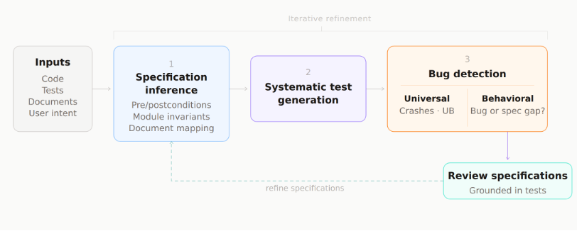
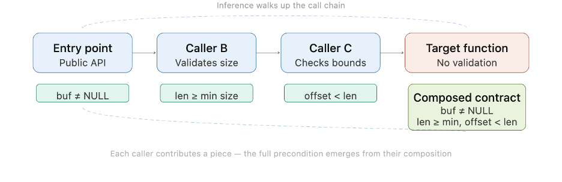

* Authors: Sarah Fakhoury, Saikat Chakraborty, Madan Musuvathi, Lef Ioannidis, Nikhil Swamy

---

We are releasing early results from DeepTest, a framework for specification-driven testing and bug discovery backed by symbolic tools.

DeepTest has been deployed across thousands of internal Microsoft components and multiple open-source projects. So far it has produced hundreds of confirmed bugs, each backed by a concrete reproducing test case, along with thousands of new tests that improve coverage in production codebases.

In this post we highlight bugs DeepTest discovered in two mature open-source projects: [MSQuic](https://github.com/microsoft/msquic) and [MimAlloc](https://github.com/microsoft/mimalloc). We begin by discussing why specification inference and validation is essential to securing critical software in the AI era and conclude with what we've learned so far applying DeepTest to harden production code.

## What frontier models can't know, and why it matters for program assurance

Bug-finding is rapidly approaching commodity status. Fuzzers have been finding crashes for over a decade and frontier models, like Opus 4.6, have accelerated efforts and can now read source code, hypothesize vulnerabilities, confirm them against running systems, and produce exploits, all with minimal human guidance. However, existing success metrics obscure a structural asymmetry. The bugs that are simple to validate automatically are the bugs for which universal correctness properties exist, properties that should hold for every program regardless of its purpose.

Memory safety is the simplest example: no correct program should read freed memory, write past the end of a buffer, or dereference a null pointer. Memory safety properties don't depend on a program intent, but rather are violations of the machine's contract with itself. Universal correctness properties typically have universal oracles: a crash, sanitizer violation, or hardware trap. You don't need to know what the program should do to know that a use-after-free is wrong. This is precisely the value proposition of a fuzzer and why we know that current frontier models are remarkably effective at finding memory corruption bugs. With universal oracles, a human in the loop isn't required to trust that a crash is real, and crash count is arguably the simplest yardstick we have for measuring progress of AI-driven exploit discovery today.

Universal properties capture only a fraction of what it means for software to be correct. Most correctness properties are behavioral, and they depend on what the program is intended to do. For example, protocol requirements, API contracts, and cross-component or module level invariants. Unlike memory safety, these properties cannot be inferred solely from machine behavior. Determining whether they are violated requires a specification of intent.

A frontier model, no matter how capable, can't reliably determine whether a program's behavior is correct without access to a specification of what "correct" means. This problem is difficult to solve because, traditionally, specifications of intent don't exist as a natural byproduct of software development. They must be constructed, validated, and maintained.

> Consider a QUIC implementation. When a protocol error occurs on an established connection, should the implementation send a CONNECTION_CLOSE frame, or is silently aborting acceptable? The correct behavior cannot be inferred from the implementation alone. It is defined by the QUIC specification, documented in RFC 9000 §11.1. Without access to that specification, neither a human reviewer nor an AI system can reliably determine whether the implementation behaves correctly.

As models become more powerful, the oracle, not the model, becomes the binding constraint. The hard problem is arguably no longer to find undefined behavior in a program, but rather asking the right questions to learn what "correct" behavior means. This also requires helping the user, human or agent, articulate correctness in a form that models and symbolic tools can leverage.

## Building oracles with DeepTest

In practice, behavioral specifications rarely exist in a formal form. Developers do not typically write formal specifications, and large codebases accumulate implicit contracts across APIs, protocols, and documentation. The answer isn't asking developers to write formal specs (they won't) or trusting models to infer intent from code alone (they can't, the code is the buggy artifact being checked).

DeepTest solves this problem by serving the middle ground. Given a target codebase, DeepTest constructs a specification index using symbolic analysis. DeepTest captures specifications such as preconditions, postconditions, lifecycle contracts, and module invariants. When external documentation exists, like RFCs, DeepTest stores mappings between natural language requirements and the code that implements them.

Agents then query this index during test generation, composing specifications across function boundaries to build a global view of component contracts. Testing focuses on execution paths where these inferred specifications are most likely to be violated.

When a test reveals a divergence between inferred specification and program behavior, one of two things has happened. Either (1) a true contract violation has surfaced a bug verifiable through a universal oracle, or (2) an inferred behavioral specification has been violated, and only the true oracle, the end user, can determine the intent.

Testing becomes the mechanism through which candidate specifications are validated. Concrete executions provide precise evidence that allows developers to confirm, reject, or refine inferred contracts. In this way, DeepTest treats specifications themselves as artifacts that can be discovered, tested, and iteratively refined.

## Bugs found by DeepTest

We applied DeepTest to MSQuic, Microsoft's open-source QUIC implementation that powers HTTP/3 across Windows, .NET, and many production services. MSQuic has undergone extensive fuzzing and auditing over years of deployment. The codebase spans roughly 200,000 lines of C and implements multiple protocol RFCs. Despite this maturity, DeepTest has already contributed over 2,500 coverage improving tests and 24 confirmed bugs. More than half of these were protocol correctness violations.

### Behavioral Specification Mismatch

[Issue #5209](https://github.com/microsoft/msquic/issues/5209): DeepTest identified a mismatch in MSQuic's connection error handling. RFC 9000 §11.1 requires that when a protocol error occurs on an established connection, the implementation must send a CONNECTION_CLOSE frame explaining the reason for termination. However, several MSQuic code paths silently aborted the connection instead of sending the required frame. As a result, the peer never learns why the connection terminated and must rely on a timeout to detect failure. This violation does not produce a crash, sanitizer signal, or obvious malfunction. Detecting it requires understanding the behavioral contract defined by the QUIC specification.

### Allocation Contract Violation Across Functions

[Issue #5881](https://github.com/microsoft/msquic/issues/5881): DeepTest also discovered a subtle memory management bug involving allocation contracts.

In MSQuic, `QuicOperationFree` releases `QUIC_RECV_CHUNK` objects by calling `CXPLAT_FREE`, which ultimately passes the pointer directly to `free()`. However, these objects are allocated using `CxPlatPoolAlloc`. This allocator returns an interior pointer within a pooled allocation rather than the original `malloc` return value. Passing this interior pointer directly to `free()` violates the allocator's precondition.

The correct deallocation path already exists in `QuicRecvChunkFree`, which checks the `AllocatedFromPool` flag and routes the pointer to either `CxPlatPoolFree` or `CXPLAT_FREE`. This bug is invisible to fuzzers and crash-based oracles. Freeing an interior pointer often corrupts allocator metadata silently, with failures appearing only much later in unrelated code.

DeepTest inferred the relevant contracts automatically:
- `CxPlatPoolAlloc` returns an interior pointer
- `free()` requires the original allocation address
- the `AllocatedFromPool` flag determines the correct deallocation path

By composing these contracts across functions, DeepTest identified the violation and generated a concrete triggering test.

### Mimalloc

DeepTest also uncovered bugs in mimalloc, Microsoft's open-source high-performance memory allocator. For example, the function `mi_heap_realloc_aligned` guarantees that the returned pointer will satisfy a requested alignment. However, when the original allocation was created using `mi_heap_alloc_aligned_at`, the reallocation preserves the original offset instead of honoring the new alignment parameter.

The returned pointer remains valid memory, so no crash or sanitizer signal occurs. The violation only surfaces later when downstream code executes SIMD instructions that assume the promised alignment. The fix was merged soon after discovery.

## Reducing False Positives by Composing Specifications

Frontier models can generate crashing inputs under white-box settings. However, not all crashes are bugs. Take the following example: a model reasoning about a function in isolation might craft input that triggers a buffer overflow. In this case, the program crashes, but the test violates an implicit contract with the function's callers: that buffer input and length are already validated upstream.

DeepTest reasons about function specifications and composes them up the call chain to infer valid program contracts. It then uses these specifications to guide test generation to reduce the incidence of false positive bugs reported.

## Program Assurance in the AI Era

The bugs found by DeepTest thus far demonstrate that specification-grounded testing finds real defects in mature software. However, the implications extend beyond bug discovery and test generation. As AI agents take on more responsibility for writing and modifying large software systems, we must be able to trust the behavior of generated code.

Testing and verification provide complementary approaches. Testing grounds claims in concrete executions, and the bugs it reveals are reproducible and actionable. However, testing is inherently underapproximate: it explores some executions and says nothing about the rest. Testing can show the presence of bugs but never their absence. To provide guarantees that a piece of software, pre-existing or AI generated, is secure we must reason about its correctness under all conditions.

Verification provides stronger guarantees by proving properties over all executions, ruling out entire classes of faults. However, proofs are inherently overapproximate: they reason about a model of the program, and the guarantees they provide depend entirely on the correctness of the specifications they verify. A program that has been proved correct must still be tested, because the proof may not account for the full reality of deployment.

Both approaches require valid specifications as a shared dependency. Tests need oracles, without a specification of expected behavior, a test can observe an output but cannot judge it. Proofs need theorems, without a specification of intended behavior, there is nothing to prove. Specifications are the trusted computing base for both activities. If the specification is wrong, the test passes on buggy code and the proof certifies an incorrect program.

In practice, these approaches have developed largely in isolation. The testing community writes tests without formal specifications and oracles are implicit. The verification community can only provide guarantees with respect to the specification, and specifications are assumed correct. Both communities underinvest in validating the shared foundation that makes the work meaningful. In the era of Agentic Software Engineering, agents generate not just patches but entire subsystems, and the specification becomes the sole artifact that can provide guarantees to an end user that the product conforms to their intent.

## Towards trustworthy Agentic Software Engineering

In an era where AI agents can generate large volumes of code, specifications become the primary mechanism through which humans communicate intent to machines. The future of program assurance is not only about more powerful models pointed at code. It is about the construction of trusted computing bases, specifications, environment models, and proofs, that make the output of those models meaningful.

Today, evaluating LLM-generated tests and bug reports requires significant human effort, and the bottleneck has shifted: it is no longer identifying potential exploits but triaging the results, merging the fixes, and maintaining the test collateral. Humans are the bottleneck in the Agentic Software Engineering loop and there is a clear need to rethink the systems we have in supporting humans in facing a tide of AI artifacts. Current workflows involve developers staring at a test failure and trying to decide whether it's a real bug or a bad test.

Knowing when to request human feedback and when to trust automated patching remains an open research challenge. Bug reports grounded in concrete test cases and validated by universal oracles are tractable to automate. Bug reports that depend on intended program behavior where intent cannot be inferred from any authoritative source are harder, and surfacing the right questions to the right humans at the right time is an unsolved problem.

With DeepTest we are building a system that presents users with evidence: a candidate specification extracted from an RFC, a concrete execution that violates it, an explanation of why the violation matters, with provenance across all artifacts. Supporting the construction of an oracle with an informed user at the center of the loop, confirming, rejecting, and refining specifications. We must equip reviewers with better evidence to reason about correctness, better tools for reviewing candidate specifications, and better infrastructure for maintaining those specifications as code evolves.

DeepTest demonstrates that specification-grounded testing can uncover real defects in mature systems that have already undergone extensive fuzzing and review. As software development becomes increasingly automated, specifications will become the primary mechanism by which humans communicate intent to machines. Building systems that can infer, validate, and maintain those specifications is therefore not just a testing problem it is foundational to trustworthy software engineering in the age of AI.

---

*Acknowledgements: Shuvendu Lahiri, Daan Leijen, Guillaume Hetier, Mei Yang, Denny Sun*
