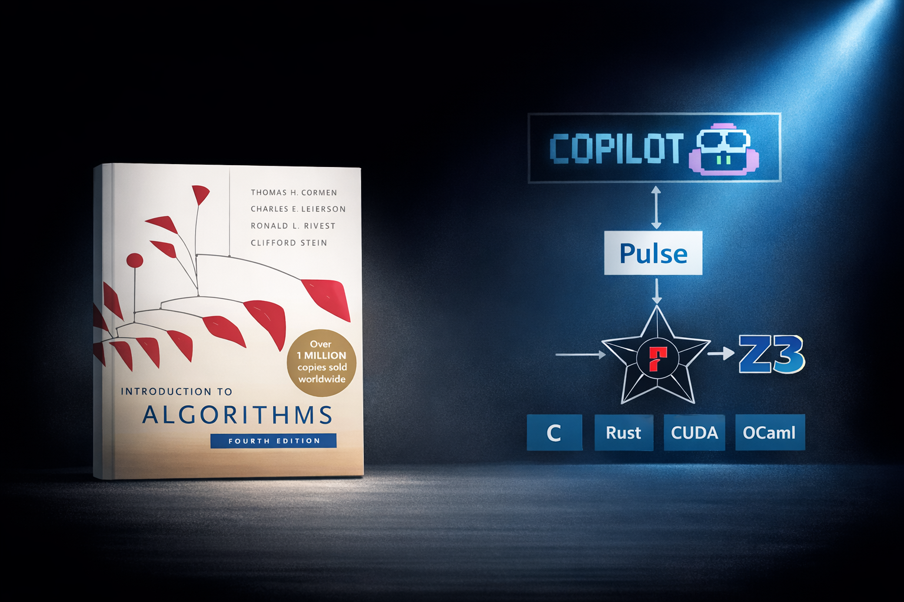

* Author: Nik Swamy and Shuvendu Lahiri

In our last two blog posts, we discussed using [AI agents to author verified
software libraries at scale](blog/2026-0306-autoclrs) and the [importance of
intent formalization](blog/2026-03-05-shuvendu-intent-formalization) in the
software development process, especially when untrustworthy AI agents write
code. This post puts these ideas together by using a simple, folklore
methodology (that we're calling *small proof-oriented tests*, or SPOTs) to
identify and automatically fix specification gaps in AutoCLRS, our agentic
formalization of the CLRS textbook.



> Note: This image was produced by Copilot from [this
 image](../../../assets/AutoCLRS.png), which in turn uses [Wikipedia's cover
 image for the book](https://en.wikipedia.org/wiki/File:Clrs4.jpeg).


## Small Proof-Oriented Tests

An old idea, popularized in the last decade especially by the [DeepSpec
project](https://deepspec.org/main), is for specifications of verified
components to be "two-sided". That is, a component specification should not only
be strong enough to prove the correctness of the implementation, but also be
strong enough to conduct proofs of clients of that component. In other words,
specifications of components should be "precise" enough to be used in client
proofs.

A natural question then is whether the specifications of AutoCLRS are precise.
One way to judge this (building on an idea explored in [this
paper](https://arxiv.org/abs/2406.09757)) is to exercise each verified algorithm
by writing a small, concrete, *verified* test case, proving that the test always
succeeds. Small proof-oriented tests have some useful properties:

* A concrete test for a verified library is always useful. As [Donald Knuth
  famously once said](https://staff.fnwi.uva.nl/p.vanemdeboas/knuthnote.pdf):
  "Beware of bugs in the above code; I have only proved it correct, not tried
  it." Actually running a test against the verified code can shake out important
  specification bugs, e.g., issues with how the specification models the
  execution environment of the program.

* Verifying that the test always succeeds is useful way to assess whether or not
  the specification is precise enough to prove a client program correct.

* The test exercises the specification on a *small* concrete instance, e.g.,
  sorting a list of three numbers. This makes the expected output easy to judge.

* Such tests are also useful API samples, e.g., documenting how to use verified
  libraries, both concretely and for proof.

We had agents generate SPOTs for all the algorithms in AutoCLRS and found
several specification gaps. Then, over the course of nearly 300 additional
commits to the repository, we had agents fix these specification gaps and
associated proofs.

### Some Takeaways

* Writing SPOTs has always been good proof-engineering practice. Instructing
  agents to write such tests remains good practice, and is a useful way to find
  specification gaps.

* A key principle of agentic engineering is to find ways to "close the feedback
  loop", so that agents can iterate towards meeting some objective. Using SPOTs
  as a feedback mechanism for agentic proof-oriented programming is a great
  example of this principle in action.

* We applied SPOTs to AutoCLRS after most of the code was already written, but
  it would be interesting to apply SPOTs earlier in the development process. For
  example, one could start by settling the interfaces of libraries and sketch
  SPOTs for them to check them for precision before any proofs are written. Of
  course, settling on specifications early runs the risk of choosing specs that
  cannot actually be proven, so the right model would strike a balance between
  early specification tests followed by proof attempts and repeated refinement.

* SPOTs are not absolute or foolproof: they are small, and may not cover all the
  aspects of a specification, so they can miss some gaps. There's also the
  danger of agents over-fitting specifications to the SPOTs, though we have yet
  to see this happen in practice.
  
* SPOTs also need to be reviewed, though because they are small and concrete,
  they can be easier to review than large, abstract specifications.

A full report of SPOTs on AutoCLRS is available
[here](https://github.com/FStarLang/AlgoStar/blob/main/autoclrs/TEST_REVIEW_REPORT.md),
with a more detailed discussion written by us, as well as an agent-authored
report of the findings.

## A First Example: Insertion Sort

Let's take a very simple example to start with: the signature of a verified
implementation of insertion sort.

```pulse
fn insertion_sort
  (a: array int)
  (#s0: Ghost.erased (Seq.seq int))
  (len: SZ.t)
  (ctr: GR.ref nat)
  (#c0: erased nat)
 requires A.pts_to a s0
 requires GR.pts_to ctr c0
 requires pure (
    SZ.v len == Seq.length s0 /\
    Seq.length s0 <= A.length a)
 ensures exists* s (cf: nat). 
    A.pts_to a s **
    GR.pts_to ctr cf **
    pure (
      Seq.length s == Seq.length s0 /\
      sorted s /\
      permutation s0 s /\
      complexity_bounded cf (reveal c0) (SZ.v len))
```

The postcondition of this function says that the output sequence `s` is a sorted
permutation of the input sequence `s0` (and that a ghost variable that counts
the number of operations in `insertion_sort` is bounded by the expression
`complexity_bounded`).

Now, this looks like a reasonable specification of a sorting function, but are
the `sorted` and `permutation` predicates accurate, and is `complexity_bounded`
a tight complexity bound for insertion sort? To be entirely sure, one should
read these specifications carefully and form an opinion. But, as we'll see
shortly, even a careful reading can miss some subtle aspects.

A SPOT for insertion sort is available
[here](https://github.com/FStarLang/AlgoStar/blob/main/autoclrs/ch02-getting-started/CLRS.Ch02.InsertionSort.ImplTest.fst)
and excerpted below:


```pulse
(* Spec validation: insertion_sort on [3;1;2] produces [1;2;3].
   Returns bool with runtime checks that survive extraction to C. *)
fn test_insertion_sort_3 ()
  returns r: bool
  ensures pure (r == true)
{
  // Input: [3; 1; 2]
  let arr = alloc 0 3sz;
  arr.(0sz) <- 3;  arr.(1sz) <- 1;  arr.(2sz) <- 2;

  // Create ghost counter (starts at 0)
  let ctr = Ghost.alloc #nat 0;

  insertion_sort arr 3sz ctr;  //call the verified library

  //a lemma proving that a sorted permutation of [3;2;1] is [1;2;3]
  completeness_sort3 (value_of arr); 

  // Verify complexity bound: at most n*(n-1)/2 = 3 comparisons
  assert (pure (value_of ctr <= 3));

  // Runtime check (survives extraction to C)
  let pass = (arr.(0sz) = 1) && (arr.(1sz) = 2) && (arr.(2sz) = 3);

  // Cleanup
  Ghost.free ctr;
  free arr;
  pass //proves that pass = true
}
```

The test allocates an array `arr` with `[3;2;1]` and a ghost counter `ctr` for
complexity tracking, calls `insertion_sort`, and then proves afterwards that the
array contains `[1;2;3]` and that `value_of ctr <= 3`. The check on the array
contents is executable and runs in the concrete C code produced by Pulse, but
the check on the `ctr` is just a proof artifact---the `ctr` is ghost and does
not exist at runtime.

This provides good evidence that the specification of `insertion_sort` is
precise and usable to prove a client program correct. The proof is not entirely
trivial: the `completeness_sort3` lemma proves that the sorted permutation of
`[3;2;1]` can only be `[1;2;3]` which takes a few lines to do. Though it's time
consuming, writing small proof-oriented tests is a standard part of
proof-engineering practice, and, perhaps unsurprisingly by now, agents can
easily write SPOTs too.

## SPOTs for AutoCLRS

As discussed in [our previous post](/blog/2026-03-06-autoclrs/), a big part of
what's remaining in AutoCLRS is a scalable way to review and find specific gaps.
Using agents to write SPOTs to find gaps has been an effective way to do this.
Our [first run of
SPOTs](https://github.com/FStarLang/AlgoStar/blob/2f0ecc02d397e0ff8c43f02b9cf9cc14c172fcbc/autoclrs/TEST_REVIEW_REPORT.md)
revealed that 8 algorithms had interesting specification gaps, as shown below. 

| Algorithm | Key Spec Gaps |
|-----------|---------------------|
| Hash Table (Ch11) — ⚠️ Weak insert | Insert postcondition doesn't guarantee success |
| BST Array (Ch12) — ❌ Too weak | No reachability; insert→search broken |
| Union-Find (Ch21) — ⚠️ Moderate | Rank bound not preserved in postcondition |
| BFS (Ch22) — ⚠️ Weak | No shortest-path optimality in postcondition |
| DFS (Ch22) — ⚠️ Weak | Spec↔Impl disconnect; theorems not exposed |
| Kruskal (Ch23) — ⚠️ Weak  | No spanning tree or MST property |
| Prim (Ch23) — ❌ Critical | Postcondition admits incorrect outputs |
| Bellman-Ford (Ch24) — ⚠️ Moderate | Correctness conditional on runtime boolean |

While the remaining 44 algorithms were deemed to already have sufficiently
precise specifications, and we have reviewed the tests and found them to be
useful, judging this to be an accurate assessment of precision would be
hasty---SPOTs are small and do not necessarily cover all the aspects of a
specification, so it's quite possible that some gaps were missed.

Let's look in detail at a couple of the algorithms with specification gaps, and
how they were fixed.

### Hash Table: Under-specified Error Conditions

Chapter 11 of CLRS defines a linear-probing hash table, implemented in a single
fixed-size array: when a collision occurs, the table searches for the next
available slot "further down" the array. This means that the hash table can run
out of space and insertions can fail, so `insert` returns a boolean `result`
indicating whether or not the insertion succeeded. An initial version of
`insert` had a precise specification in case `result=true`, and also proved that
the hash table is unchanged when `result=false`. But, it did not guarantee when
`result=false` would occur, so the specification allowed the implementation to
always return `false`, even when the hash table actually still had space. 

Such specification gaps (e.g., describing the error behavior of APIs) are easy
to miss by a manual review, but a SPOT for `insert` caught it. Here's an excerpt
of the SPOT, the comments are also produced by the agent.

```pulse
fn test_insert_then_search ()
{
  let table = hash_table_create 3sz;
  // Insert key 0
  let b = hash_insert table 3sz 0 ctr;
  if b {
    // === Insert succeeded ===
    // From insert postcondition:
    //   key_in_table s' 3 0 /\ key_findable s' 3 0 /\ valid_ht s' 3

    // Search for key 0 — should find it
    let r = hash_search table 3sz 0 ctr;
    // Postcondition precision: search must find key 0.
    assert (pure (SZ.v r < 3));
    // Cleanup
    hash_table_free tv;
  } else {
    // === Insert failed ===
    // Postcondition: s' == s (table unchanged)
    // This branch represents a spec weakness: the postcondition of hash_insert
    // does not guarantee success when empty slots are available.

    // Cleanup
    hash_table_free tv;
  }
}
```

After finding and fixing this gap, a revised SPOT for `insert` is straight-line code like this:

```pulse
fn test_insert_then_search ()
  returns res: bool { res == true }
{
  let tv = hash_table_create 3sz;
  // Insert key 0
  let b = hash_insert table 3sz 0 ctr;
  // Search for key 0 — must find it
  let r = hash_search table 3sz 0 ctr;
  // Compute runtime-observable result
  let ok = (b && (r <^ 3sz));
  // Cleanup
  hash_table_free tv;
  ok
}
```

### Prim: An Incomplete Proof

Prim's algorithm for minimal spanning trees had a critical specification gap.
The original version of the algorithm had a postcondition `prim_correct key_seq
parent_seq weights_seq (SZ.v n) (SZ.v source)` but using this predicate to
conclude that the result of Prim is actually a minimal spanning tree required
the use of a lemma, `prim_result_is_mst`, whose [precondition was too strong to
be
useful](https://github.com/FStarLang/AlgoStar/blob/26caa8051ef42a0afa9066101f0b2a9a55a44b88/autoclrs/ch23-mst/CLRS.Ch23.Prim.Impl.fsti#L133-L139).

An [initial SPOT for
Prim](https://github.com/FStarLang/AlgoStar/blob/2f0ecc02d397e0ff8c43f02b9cf9cc14c172fcbc/autoclrs/ch23-mst/CLRS.Ch23.Kruskal.ImplTest.fst)
set up a small three-vertex triangle graph below and found that one could not
actually prove that the output of Prim had the expected minimal spanning tree.

```pulse
  // --- Set up weight matrix for 3-vertex triangle ---
  // Graph:  0 --1-- 1 --2-- 2
  //         |               |
  //         +------3--------+
```

The agents report:

```pulse
  // FINDING: prim_correct only captures array shapes and boundary
  // values (key[source]=0, keys bounded, parent[source]=source).
  // It does NOT capture any MST structural property (spanning,
  // acyclic, minimum weight, correct parent relationships).
```

Fixing the proof of Prim required several rounds of agent iteration, but
eventually the specification was strengthened to capture the necessary
properties, and the proof was completed.

The [revised SPOT for
Prim](https://github.com/FStarLang/AlgoStar/blob/main/autoclrs/ch23-mst/CLRS.Ch23.Prim.ImplTest.fst)
contains the same triangle graph but can prove that the output tree contains
only the edges from 0 to 1 and 1 to 2 and that the total weight of the tree is
3, as expected.

## Parting Thoughts

The interplay between testing and proving is a rich area of study, and SPOTs for
reviewing agent-authored specifications is yet another example of testing and
proving put to work together. While SPOTs have been useful in finding and fixing
specification gaps in AutoCLRS, we should also point out some limitations.

*Over-fitting Specifications to Tests* One obvious danger is for agents that
author both the libraries and their SPOTs to over-fit the specifications to the
tests, e.g., the specification of `insertion_sort` might only specify its
behavior on 3-element lists. However, the kinds of specification gaps that we
have observed in practice are not due to over-specialization but rather
under-specification. A more systematic way to guard against over-fitting would
be to have separate agents author the SPOTs and the specifications, and for the
SPOTs to be held back (much like in programming assignments) from the
proof-authoring agents. One could also have separate SPOT-reviewing agents, a
["rubber-duck"
feature](https://github.blog/ai-and-ml/github-copilot/github-copilot-cli-combines-model-families-for-a-second-opinion/)
that Copilot now makes available by default.

*Tasteful Specification* Although SPOTs are effective in finding specification
gaps, they do not provide any guidance on the style of specification. Good
specifications are abstract, concise, and elegant, matters of good taste at
which agents are often lacking. One could perhaps get at some aspects of this by
assessing the level of automation in the proofs of SPOTs. Good clean specs
usually also lead to more concise proofs, and the proofs of SPOTs in AutoCLRS
are often quite verbose, so there's still lots of room for improvement.